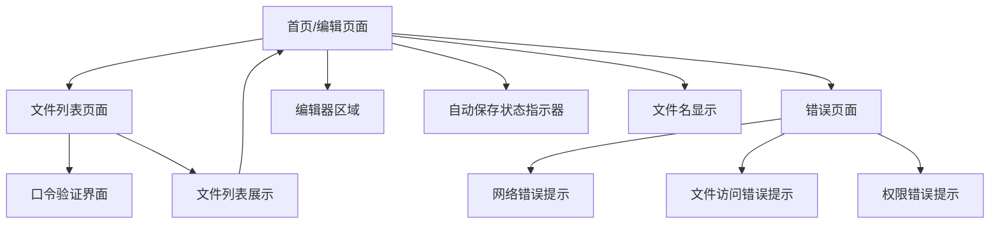
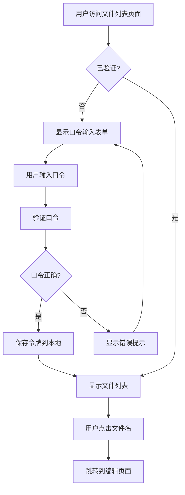

# Vue3 + Python Notepad 应用 - UI/UX 规格文档

**文档版本**: 1.0  
**创建日期**: 2025-12-18  
**作者**: BMad UX Expert  
**项目状态**: Greenfield (全新开发)

---

## 1. Introduction

This document defines the user experience goals, information architecture, user flows, and visual design specifications for Vue3 + Python Notepad 应用's user interface. It serves as the foundation for visual design and frontend development, ensuring a cohesive and user-centered experience.

### 1.1 Overall UX Goals & Principles

#### Target User Personas

- **日常记录用户**: 需要快速记录想法、笔记的普通用户，重视简单易用
- **技术工作者**: 开发者、研究人员等需要频繁记录技术内容，重视效率和可靠性
- **团队协作者**: 小型团队成员，需要共享和访问文本文件，重视访问控制和文件管理

#### Usability Goals

- **易学性**: 新用户无需阅读文档即可在30秒内开始编辑
- **效率**: 熟练用户可以通过URL直接访问文件，无需额外点击
- **错误预防**: 自动保存机制防止数据丢失，文件名验证防止路径遍历攻击
- **可记忆性**: 界面设计遵循常见文本编辑器模式，用户可凭直觉操作

#### Design Principles

1. **极简主义** - 去除所有非必要元素，聚焦于文本编辑核心体验
2. **即时响应** - 每个用户操作都应有明确的视觉反馈
3. **无干扰编辑** - 界面元素不应分散用户对内容的注意力
4. **渐进式披露** - 只在需要时显示辅助功能
5. **无障碍优先** - 从设计开始就确保所有用户都能使用

### 1.2 Change Log

| 日期 | 版本 | 描述 | 作者 |
|------|------|------|------|
| 2025-12-18 | 1.0 | 初始UI/UX规格文档创建 | BMad UX Expert |

---

## 2. Information Architecture (IA)

### 2.1 Site Map / Screen Inventory



### 2.2 Navigation Structure

**Primary Navigation:** URL驱动的页面导航，通过修改URL直接访问不同文件

**Secondary Navigation:** 文件列表页面中的文件链接，点击直接跳转到对应编辑页面

**Breadcrumb Strategy:** 简单的路径显示，如 `Home > filename.txt`，仅在文件列表页面显示

---

## 3. User Flows

### 3.1 Flow 1: 新建文件编辑

**User Goal:** 创建并编辑一个新的文本文件

**Entry Points:** 
- 直接访问 `/notes/newfile.txt` (newfile.txt不存在)
- 从文件列表页面点击"新建文件"按钮

**Success Criteria:** 
- 用户可以立即开始输入内容
- 内容自动保存，无需手动操作
- 文件成功创建并可通过URL访问

#### Flow Diagram

```mermaid
graph TD
    A[用户访问不存在的文件URL] --> B{文件存在?}
    B -->|否| C[创建空白文件]
    B -->|是| D[加载现有内容]
    C --> E[显示编辑界面]
    D --> E
    E --> F[用户输入内容]
    F --> G{内容变化?}
    G -->|是| H[500ms后触发自动保存]
    G -->|否| I[继续监听]
    H --> J[保存到服务器]
    J --> K[显示"已保存"状态]
    K --> I
    I --> F
```

#### Edge Cases & Error Handling:
- 网络断开时显示"连接断开"状态，自动重连后恢复保存
- 保存失败时显示"保存失败"提示，提供重试按钮
- 文件名包含非法字符时显示错误提示

#### Notes:
- 文件名大小写敏感，遵循Unix文件系统规则
- 自动保存防抖时间设置为500ms，平衡实时性和性能

### 3.2 Flow 2: 文件列表访问

**User Goal:** 查看并访问所有已保存的文本文件

**Entry Points:** 
- 直接访问 `/file-list` URL
- 编辑页面中的"文件列表"链接

**Success Criteria:** 
- 用户通过口令验证后能看到所有文件列表
- 点击文件名能直接跳转到编辑页面
- 文件按创建时间倒序排列

#### Flow Diagram



#### Edge Cases & Error Handling:
- 口令验证失败时显示明确的错误信息
- 令牌过期时重新要求验证
- 文件列表为空时显示友好提示

#### Notes:
- 令牌有效期设置为24小时，平衡安全性和便利性
- 分页加载策略：每页显示50个文件，支持滚动加载

---

## 4. Wireframes & Mockups

**Primary Design Files:** 设计将在开发过程中通过代码实现，不使用外部设计工具

### 4.1 Key Screen Layouts

#### Screen 1: 文本编辑页面

**Purpose:** 提供无干扰的文本编辑体验

**Key Elements:**
- 顶部栏：文件名显示 + 自动保存状态指示器
- 主体区域：全屏文本编辑器
- 右上角：文件列表链接（小图标）

**Interaction Notes:**
- 页面加载时自动聚焦到编辑器
- 保存状态实时更新，不干扰编辑
- 支持键盘快捷键（Ctrl+S 手动保存）

#### Screen 2: 文件列表页面

**Purpose:** 展示所有文件并提供快速访问

**Key Elements:**
- 顶部：标题 + 口令验证状态
- 主体：文件列表（文件名、创建时间）
- 底部：分页控件/加载更多按钮

**Interaction Notes:**
- 文件名可点击，跳转到编辑页面
- 支持按文件名搜索/过滤
- 响应式设计，适配移动设备

---

## 5. Component Library / Design System

**Design System Approach:** 使用轻量级设计系统，基于原生HTML元素和CSS，避免过度工程化

### 5.1 Core Components

#### Component: 编辑器 (TextEditor)

**Purpose:** 提供文本输入和编辑功能

**Variants:** 
- 全屏模式（默认）
- 紧凑模式（移动设备）

**States:**
- 正常编辑状态
- 保存中状态
- 保存失败状态
- 只读状态（文件被锁定时）

**Usage Guidelines:** 
- 占据主要视口空间
- 使用等宽字体提高可读性
- 支持Tab缩进

#### Component: 状态指示器 (StatusIndicator)

**Purpose:** 显示系统状态和操作反馈

**Variants:**
- 保存状态（已保存/保存中/保存失败）
- 网络状态（已连接/断开连接）
- 错误提示

**States:**
- 正常状态（绿色）
- 处理中状态（黄色/动画）
- 错误状态（红色）

**Usage Guidelines:**
- 使用颜色和图标组合
- 状态变化时添加过渡动画
- 位置固定，不随页面滚动

#### Component: 文件列表项 (FileListItem)

**Purpose:** 在文件列表中显示单个文件信息

**Variants:**
- 标准列表项
- 搜索高亮项

**States:**
- 正常状态
- 悬停状态
- 焦点状态

**Usage Guidelines:**
- 显示文件名和创建时间
- 点击区域覆盖整个列表项
- 支持键盘导航

---

## 6. Branding & Style Guide

**Brand Guidelines:** 采用现代、简洁的设计风格，强调内容而非装饰

### 6.1 Color Palette

| Color Type | Hex Code | Usage |
|------------|----------|-------|
| Primary | #2c3e50 | 主要文本、重要交互元素 |
| Secondary | #7f8c8d | 次要文本、辅助信息 |
| Accent | #3498db | 链接、按钮、强调元素 |
| Success | #27ae60 | 成功状态、保存完成 |
| Warning | #f39c12 | 警告信息、注意提示 |
| Error | #e74c3c | 错误状态、失败提示 |
| Neutral | #ecf0f1 | 背景、边框、分隔线 |

### 6.2 Typography

#### Font Families
- **Primary:** -apple-system, BlinkMacSystemFont, "Segoe UI", Roboto, sans-serif
- **Secondary:** "Helvetica Neue", Arial, sans-serif
- **Monospace:** SFMono-Regular, Consolas, "Liberation Mono", Menlo, monospace

#### Type Scale

| Element | Size | Weight | Line Height |
|---------|------|--------|-------------|
| H1 | 24px | 600 | 1.4 |
| H2 | 20px | 600 | 1.4 |
| H3 | 16px | 600 | 1.4 |
| Body | 14px | 400 | 1.5 |
| Small | 12px | 400 | 1.4 |

### 6.3 Iconography

**Icon Library:** 使用简单的SVG图标，避免依赖外部图标库

**Usage Guidelines:**
- 图标大小统一为16px或24px
- 使用相同的线条粗细（2px）
- 保持简洁的视觉风格

### 6.4 Spacing & Layout

**Grid System:** 使用CSS Flexbox布局，不依赖固定网格系统

**Spacing Scale:** 基于8px的间距系统
- 小间距：8px
- 中等间距：16px
- 大间距：24px
- 特大间距：32px

---

## 7. Accessibility Requirements

### 7.1 Compliance Target

**Standard:** WCAG 2.1 AA

### 7.2 Key Requirements

**Visual:**
- Color contrast ratios: 文本对比度至少4.5:1，大文本至少3:1
- Focus indicators: 所有交互元素有清晰的焦点指示器
- Text sizing: 支持浏览器缩放至200%而不影响功能

**Interaction:**
- Keyboard navigation: 所有功能可通过键盘访问
- Screen reader support: 适当的ARIA标签和语义化HTML
- Touch targets: 最小触摸目标44px × 44px

**Content:**
- Alternative text: 所有有意义的图像提供alt文本
- Heading结构: 正确的标题层级结构
- Form labels: 所有表单元素有关联的标签

### 7.3 Testing Strategy

- 使用axe-core自动化测试工具
- 键盘导航测试
- 屏幕阅读器测试（NVDA, VoiceOver）
- 色彩对比度测试

---

## 8. Responsiveness Strategy

### 8.1 Breakpoints

| Breakpoint | Min Width | Max Width | Target Devices |
|------------|-----------|-----------|----------------|
| Mobile | 320px | 767px | 手机设备 |
| Tablet | 768px | 1023px | 平板设备 |
| Desktop | 1024px | 1439px | 笔记本、桌面显示器 |
| Wide | 1440px | - | 大屏显示器 |

### 8.2 Adaptation Patterns

**Layout Changes:** 
- 移动设备隐藏文件名显示，使用汉堡菜单
- 平板设备保持单列布局，调整间距

**Navigation Changes:**
- 移动设备使用底部导航栏
- 桌面设备使用顶部导航

**Content Priority:**
- 移动设备优先显示编辑器，辅助信息折叠
- 大屏设备并排显示更多信息

**Interaction Changes:**
- 移动设备增加触摸友好的按钮尺寸
- 桌面设备支持右键菜单和快捷键

---

## 9. Animation & Micro-interactions

### 9.1 Motion Principles

- **功能性优先**: 动画服务于功能，而非装饰
- **快速响应**: 动画时长不超过200ms
- **自然流畅**: 使用缓动函数模拟自然运动
- **尊重用户偏好**: 遵循系统的减少动画设置

### 9.2 Key Animations

- **保存状态切换**: 透明度变化（Duration: 150ms, Easing: ease-out）
- **错误提示滑入**: 从顶部滑入（Duration: 200ms, Easing: ease-out）
- **文件列表项悬停**: 背景色渐变（Duration: 100ms, Easing: ease-in-out）
- **页面切换**: 淡入淡出（Duration: 150ms, Easing: ease-out）

---

## 10. Performance Considerations

### 10.1 Performance Goals

- **Page Load**: 首屏加载时间不超过2秒
- **Interaction Response**: 交互响应时间不超过100ms
- **Animation FPS**: 动画帧率保持60fps

### 10.2 Design Strategies

- 使用CSS变量实现主题切换，减少重绘
- 优化字体加载策略，使用font-display: swap
- 实现虚拟滚动处理大量文件列表
- 使用Intersection Observer实现懒加载

---

## 11. Next Steps

### 11.1 Immediate Actions

1. 与开发团队确认技术可行性
2. 创建原型验证核心交互流程
3. 准备设计系统的基础组件
4. 制定前端架构设计方案

### 11.2 Design Handoff Checklist

- [x] 所有用户流程已文档化
- [x] 组件清单已完成
- [x] 无障碍需求已定义
- [x] 响应式策略已明确
- [x] 品牌指导原则已纳入
- [x] 性能目标已建立

---

## 12. Checklist Results

UI/UX规格文档已完成，包含所有必要的用户流程、组件定义、设计规范和实施指导。文档可作为前端开发的完整指导，确保用户体验的一致性和质量。