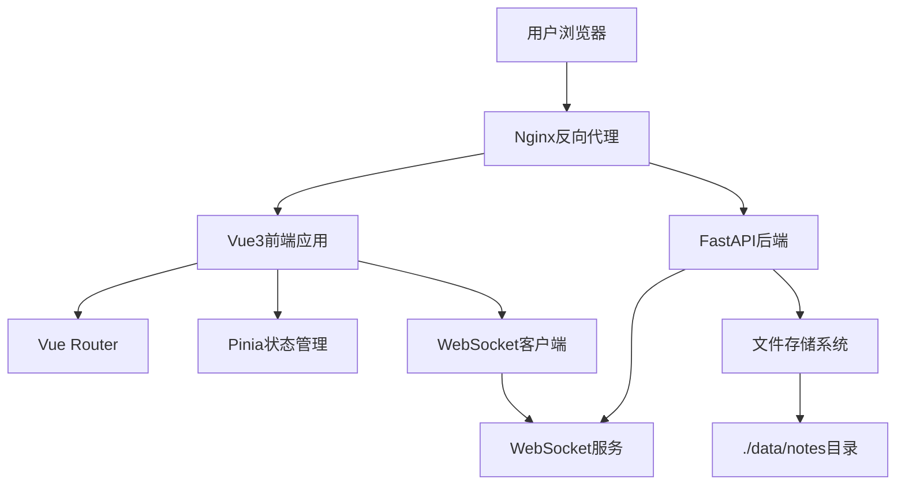
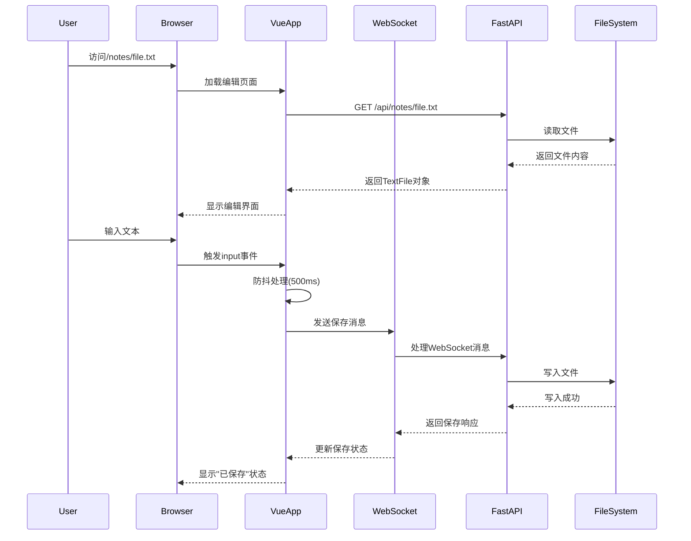
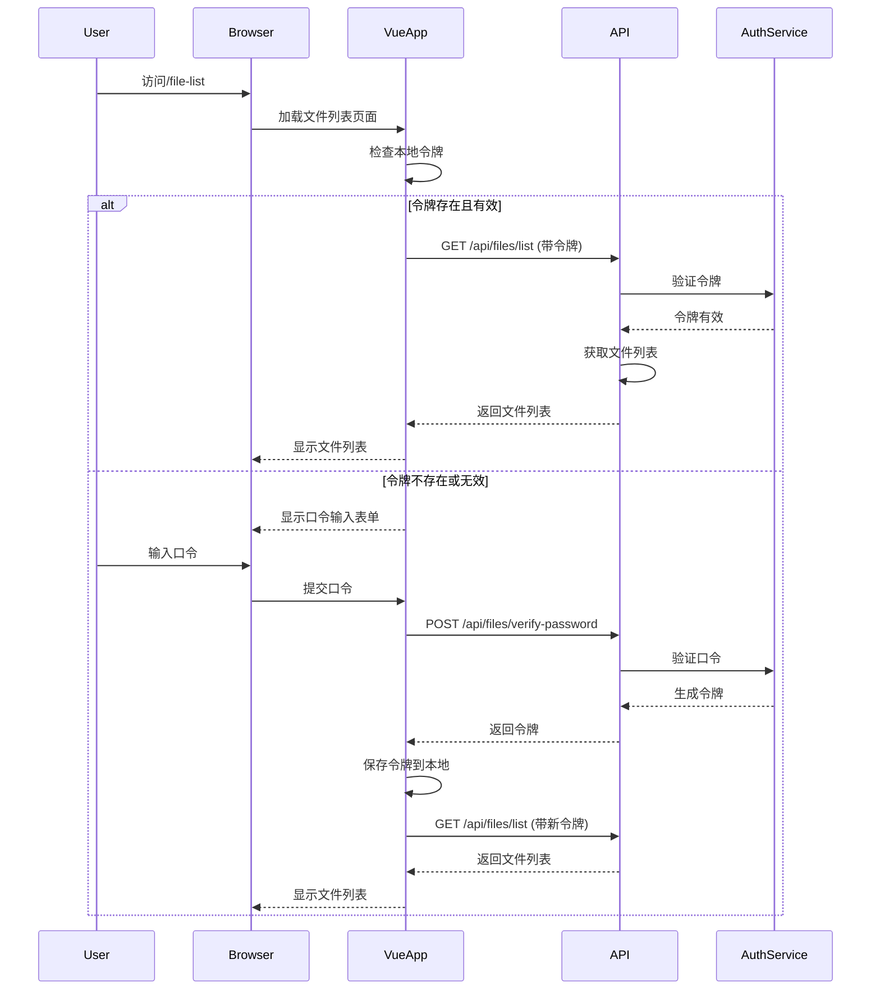
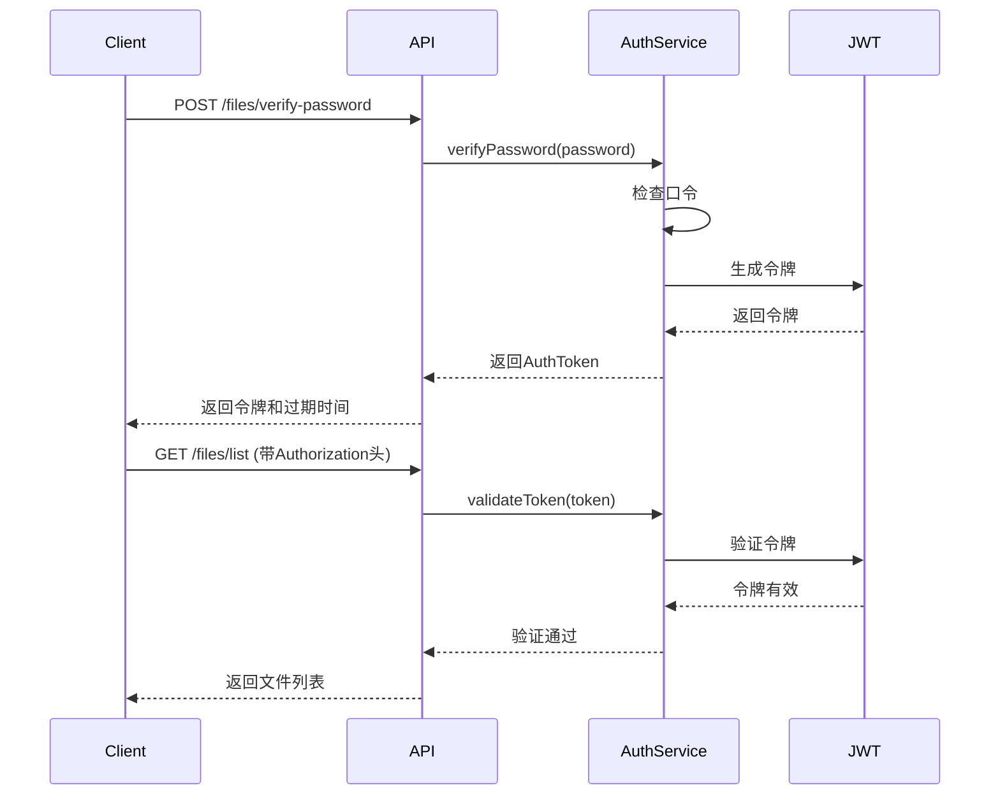

# Vue3 + Python Notepad 应用 - 全栈架构文档

**文档版本**: 1.0  
**创建日期**: 2025-12-18  
**作者**: BMad Architect  
**项目状态**: Greenfield (全新开发)

---

## 1. Introduction

This document outlines the complete fullstack architecture for Vue3 + Python Notepad 应用, including backend systems, frontend implementation, and their integration. It serves as the single source of truth for AI-driven development, ensuring consistency across the entire technology stack.

This unified approach combines what would traditionally be separate backend and frontend architecture documents, streamlining the development process for modern fullstack applications where these concerns are increasingly intertwined.

### 1.1 Starter Template or Existing Project

N/A - Greenfield project

### 1.2 Change Log

| 日期 | 版本 | 描述 | 作者 |
|------|------|------|------|
| 2025-12-18 | 1.0 | 初始全栈架构文档创建 | BMad Architect |

---

## 2. High Level Architecture

### 2.1 Technical Summary

This application uses a modern monolithic architecture with a Vue3 frontend and Python FastAPI backend, deployed via Docker containers on Ubuntu infrastructure. The system provides real-time text editing with automatic saving through WebSocket communication, while maintaining simplicity through file-based storage without database complexity. The architecture prioritizes performance, security, and ease of deployment while supporting URL-driven document access and secure file management.

### 2.2 Platform and Infrastructure Choice

**Platform:** Self-hosted Docker deployment  
**Key Services:** Docker, Nginx, Python FastAPI, Node.js  
**Deployment Host and Regions:** Ubuntu物理机部署，单区域部署

Rationale: Self-hosted approach provides maximum control over file storage and security while keeping infrastructure costs minimal. Docker containerization ensures consistent development and production environments.

### 2.3 Repository Structure

**Repository Structure:** Simple frontend/backend separation  
**Monorepo Tool:** None (simplified structure)  
**Package Organization:** 

- `frontend`: Vue3 frontend application
- `backend`: Python FastAPI backend

Rationale: Simplified structure reduces complexity for this focused application, making it easier to understand and maintain.

### 2.4 Architecture Diagram



### 2.5 Architectural Patterns

- **Monolithic Architecture:** Single deployable unit with clear frontend/backend separation - _Rationale:_ Simplifies deployment and debugging for this focused application
- **Component-Based UI:** Reusable Vue3 components with TypeScript - _Rationale:_ Maintainability and type safety across the codebase
- **WebSocket Communication:** Real-time bidirectional communication - _Rationale:_ Enables instant auto-save without polling overhead
- **File-Based Storage:** Direct file system storage instead of database - _Rationale:_ Simplifies deployment and aligns with the notepad metaphor
- **Repository Pattern:** Abstract file operations - _Rationale:_ Enables testing and future storage migration
- **JWT Authentication:** Token-based authentication for file list access - _Rationale:_ Stateless authentication suitable for this simple use case

---

## 3. Tech Stack

### 3.1 Technology Stack Table

| Category | Technology | Version | Purpose | Rationale |
|----------|------------|---------|---------|-----------|
| Frontend Language | TypeScript | 5.0+ | 类型安全的JavaScript开发 | 提供编译时类型检查，提高代码质量 |
| Frontend Framework | Vue 3 | 3.3+ | 构建响应式用户界面 | 轻量级、高性能、易学易用 |
| UI Component Library | 自定义组件 | - | 构建应用特定UI组件 | 避免过度工程化，保持轻量 |
| State Management | Pinia | 2.1+ | Vue状态管理 | Vue官方推荐，简单直观 |
| Backend Language | Python | 3.10+ | 后端服务开发 | 丰富的生态系统，易于部署 |
| Backend Framework | FastAPI | 0.104+ | 构建高性能API | 自动API文档，内置WebSocket支持 |
| API Style | REST + WebSocket | - | 前后端通信协议 | REST用于标准操作，WebSocket用于实时通信 |
| Database | 无 | - | 不使用数据库 | 简化架构，直接使用文件系统 |
| Cache | 内存缓存 | - | 提高文件读取性能 | 减少重复的文件系统操作 |
| File Storage | 本地文件系统 | - | 存储文本文件 | 简单直接，符合notepad概念 |
| Authentication | JWT | - | 文件列表访问验证 | 无状态，适合简单认证需求 |
| Frontend Testing | Vitest | 1.0+ | 前端单元测试 | Vite集成，快速测试 |
| Backend Testing | pytest | 7.4+ | 后端单元测试 | Python标准测试框架 |
| E2E Testing | Playwright | 1.40+ | 端到端测试 | 跨浏览器测试支持 |
| Build Tool | Vite | 5.0+ | 前端构建工具 | 快速开发服务器和构建 |
| Bundler | Rollup | - | 前端打包 | Vite内置，优化打包 |
| IaC Tool | Docker Compose | 2.20+ | 基础设施即代码 | 简化部署和环境管理 |
| CI/CD | GitHub Actions | - | 持续集成和部署 | 与代码仓库集成 |
| Monitoring | 自定义日志 | - | 应用监控 | 轻量级日志记录 |
| Logging | Python logging + 自定义 | - | 日志记录 | 结构化日志，便于调试 |
| CSS Framework | 自定义CSS | - | 样式管理 | 避免外部依赖，保持轻量 |

---

## 4. Data Models

### 4.1 TextFile

**Purpose:** 表示存储在系统中的文本文件

**Key Attributes:**
- filename: string - 文件名（包含.txt扩展名）
- content: string - 文件内容
- created_at: datetime - 创建时间
- updated_at: datetime - 最后更新时间
- size: number - 文件大小（字符数）

#### TypeScript Interface

```typescript
interface TextFile {
  filename: string;
  content: string;
  created_at: Date;
  updated_at: Date;
  size: number;
}
```

#### Relationships

- 无关系 - 独立实体

### 4.2 FileListItem

**Purpose:** 文件列表页面显示的文件信息

**Key Attributes:**
- filename: string - 文件名
- created_at: datetime - 创建时间
- size: number - 文件大小

#### TypeScript Interface

```typescript
interface FileListItem {
  filename: string;
  created_at: Date;
  size: number;
}
```

#### Relationships

- 无关系 - 聚合数据

### 4.3 AuthToken

**Purpose:** 认证令牌

**Key Attributes:**
- token: string - JWT令牌
- expires_at: datetime - 过期时间

#### TypeScript Interface

```typescript
interface AuthToken {
  token: string;
  expires_at: Date;
}
```

#### Relationships

- 无关系 - 临时认证数据

---

## 5. API Specification

### 5.1 REST API Specification

```yaml
openapi: 3.0.0
info:
  title: Vue3 + Python Notepad API
  version: 1.0.0
  description: 简单的文本编辑器API，支持文件读写和列表功能
servers:
  - url: http://localhost:8000/api
    description: 开发环境服务器
  - url: https://your-domain.com/api
    description: 生产环境服务器

paths:
  /notes/{filename}:
    get:
      summary: 获取文件内容
      parameters:
        - name: filename
          in: path
          required: true
          schema:
            type: string
          description: 文件名（包含.txt扩展名）
      responses:
        '200':
          description: 成功返回文件内容
          content:
            application/json:
              schema:
                $ref: '#/components/schemas/TextFile'
        '404':
          description: 文件不存在
        '400':
          description: 文件名无效
    post:
      summary: 保存文件内容
      parameters:
        - name: filename
          in: path
          required: true
          schema:
            type: string
          description: 文件名（包含.txt扩展名）
      requestBody:
        required: true
        content:
          application/json:
            schema:
              type: object
              properties:
                content:
                  type: string
                  description: 文件内容
      responses:
        '200':
          description: 保存成功
          content:
            application/json:
              schema:
                $ref: '#/components/schemas/TextFile'
        '413':
          description: 文件过大
        '400':
          description: 文件名无效或内容为空

  /files/list:
    get:
      summary: 获取文件列表
      security:
        - bearerAuth: []
      parameters:
        - name: page
          in: query
          schema:
            type: integer
            default: 1
          description: 页码
        - name: limit
          in: query
          schema:
            type: integer
            default: 50
          description: 每页文件数
      responses:
        '200':
          description: 成功返回文件列表
          content:
            application/json:
              schema:
                type: object
                properties:
                  files:
                    type: array
                    items:
                      $ref: '#/components/schemas/FileListItem'
                  total:
                    type: integer
                  page:
                    type: integer
                  limit:
                    type: integer
        '401':
          description: 未授权访问
        '403':
          description: 令牌无效或过期

  /files/verify-password:
    post:
      summary: 验证访问口令
      requestBody:
        required: true
        content:
          application/json:
            schema:
              type: object
              properties:
                password:
                  type: string
                  description: 访问口令
      responses:
        '200':
          description: 验证成功
          content:
            application/json:
              schema:
                $ref: '#/components/schemas/AuthToken'
        '401':
          description: 口令错误

  /health:
    get:
      summary: 健康检查
      responses:
        '200':
          description: 服务正常
          content:
            application/json:
              schema:
                type: object
                properties:
                  status:
                    type: string
                    example: "healthy"

components:
  schemas:
    TextFile:
      type: object
      properties:
        filename:
          type: string
          example: "note.txt"
        content:
          type: string
          example: "这是文件内容"
        created_at:
          type: string
          format: date-time
        updated_at:
          type: string
          format: date-time
        size:
          type: integer
          example: 6
    
    FileListItem:
      type: object
      properties:
        filename:
          type: string
          example: "note.txt"
        created_at:
          type: string
          format: date-time
        size:
          type: integer
          example: 6
    
    AuthToken:
      type: object
      properties:
        token:
          type: string
          example: "eyJhbGciOiJIUzI1NiIsInR5cCI6IkpXVCJ9..."
        expires_at:
          type: string
          format: date-time

  securitySchemes:
    bearerAuth:
      type: http
      scheme: bearer
      bearerFormat: JWT
```

### 5.2 WebSocket API

#### 连接端点
`ws://localhost:8000/ws/{filename}`

#### 消息格式

**客户端发送保存请求:**
```json
{
  "type": "save",
  "content": "文件内容",
  "timestamp": "2023-12-18T10:30:00Z"
}
```

**服务器响应:**
```json
{
  "type": "save_response",
  "status": "success|error",
  "message": "保存成功|错误信息",
  "timestamp": "2023-12-18T10:30:00Z"
}
```

---

## 6. Components

### 6.1 Frontend Components

#### TextEditor

**Responsibility:** 提供文本编辑功能和自动保存机制

**Key Interfaces:**
- `props.filename`: string - 要编辑的文件名
- `props.initialContent`: string - 初始文件内容
- `emits.save`: (content: string) => void - 保存事件
- `emits.contentChange`: (content: string) => void - 内容变化事件

**Dependencies:** WebSocket客户端，Pinia store

**Technology Stack:** Vue 3 Composition API, TypeScript, CSS

#### FileList

**Responsibility:** 显示文件列表并提供导航功能

**Key Interfaces:**
- `props.files`: FileListItem[] - 文件列表数据
- `props.loading`: boolean - 加载状态
- `emits.fileSelect`: (filename: string) => void - 文件选择事件

**Dependencies:** API客户端，Vue Router

**Technology Stack:** Vue 3 Composition API, TypeScript, CSS

#### AuthForm

**Responsibility:** 处理口令验证表单

**Key Interfaces:**
- `emits.authSuccess`: (token: string) => void - 认证成功事件
- `emits.authError`: (message: string) => void - 认证失败事件

**Dependencies:** API客户端，本地存储

**Technology Stack:** Vue 3 Composition API, TypeScript, CSS

### 6.2 Backend Components

#### FileService

**Responsibility:** 处理文件读写操作

**Key Interfaces:**
- `readFile(filename: string): TextFile` - 读取文件
- `writeFile(filename: string, content: string): TextFile` - 写入文件
- `listFiles(page: number, limit: number): FileListItem[]` - 列出文件
- `validateFilename(filename: string): boolean` - 验证文件名

**Dependencies:** 文件系统，验证模块

**Technology Stack:** Python 3.10+, OS模块

#### AuthService

**Responsibility:** 处理认证和授权

**Key Interfaces:**
- `verifyPassword(password: string): AuthToken` - 验证口令
- `validateToken(token: string): boolean` - 验证令牌
- `generateToken(): string` - 生成令牌

**Dependencies:** JWT库，环境变量

**Technology Stack:** Python 3.10+, PyJWT

#### WebSocketHandler

**Responsibility:** 处理WebSocket连接和消息

**Key Interfaces:**
- `handleConnection(websocket: WebSocket, filename: string)` - 处理连接
- `handleMessage(websocket: WebSocket, message: dict)` - 处理消息
- `broadcastUpdate(filename: string, content: string)` - 广播更新

**Dependencies:** FastAPI WebSocket，FileService

**Technology Stack:** Python 3.10+, FastAPI

---

## 7. External APIs

N/A - 本项目不依赖外部API服务

---

## 8. Core Workflows

### 8.1 文件编辑和自动保存



### 8.2 文件列表访问认证



---

## 9. Database Schema

N/A - 本项目使用文件系统存储，不使用数据库

---

## 10. Frontend Architecture

### 10.1 Component Architecture

#### Component Organization

```
src/
├── components/           # 可复用组件
│   ├── common/          # 通用组件
│   │   ├── Button.vue
│   │   ├── Modal.vue
│   │   └── StatusIndicator.vue
│   ├── editor/          # 编辑器相关组件
│   │   ├── TextEditor.vue
│   │   └── SaveStatus.vue
│   └── files/           # 文件管理组件
│       ├── FileList.vue
│       ├── FileListItem.vue
│       └── AuthForm.vue
├── views/               # 页面组件
│   ├── EditorView.vue
│   └── FileListView.vue
├── stores/              # Pinia状态管理
│   ├── editor.ts
│   ├── files.ts
│   └── auth.ts
├── services/            # API服务
│   ├── api.ts
│   ├── websocket.ts
│   └── storage.ts
├── router/              # 路由配置
│   └── index.ts
├── utils/               # 工具函数
│   ├── validation.ts
│   └── helpers.ts
└── styles/              # 样式文件
    ├── main.css
    └── components.css
```

#### Component Template

```vue
<template>
  <div class="text-editor">
    <div class="editor-header">
      <h2>{{ filename }}</h2>
      <StatusIndicator :status="saveStatus" />
    </div>
    <textarea
      ref="editorElement"
      v-model="content"
      @input="handleInput"
      :disabled="isLoading"
      class="editor-textarea"
    />
  </div>
</template>

<script setup lang="ts">
import { ref, onMounted, watch } from 'vue';
import { useEditorStore } from '@/stores/editor';
import { useWebSocket } from '@/services/websocket';
import StatusIndicator from '@/components/common/StatusIndicator.vue';

interface Props {
  filename: string;
  initialContent?: string;
}

const props = defineProps<Props>();
const emit = defineEmits<{
  save: [content: string];
  contentChange: [content: string];
}>();

const editorStore = useEditorStore();
const { connect, sendSave, disconnect } = useWebSocket();

const content = ref(props.initialContent || '');
const saveStatus = ref<'saved' | 'saving' | 'error'>('saved');
const isLoading = ref(false);
const editorElement = ref<HTMLTextAreaElement>();

let saveTimeout: number | null = null;

const handleInput = () => {
  emit('contentChange', content.value);
  
  if (saveTimeout) {
    clearTimeout(saveTimeout);
  }
  
  saveStatus.value = 'saving';
  saveTimeout = window.setTimeout(() => {
    sendSave(props.filename, content.value);
  }, 500);
};

onMounted(() => {
  connect(props.filename);
  editorElement.value?.focus();
});

watch(() => props.initialContent, (newContent) => {
  if (newContent !== undefined) {
    content.value = newContent;
  }
});
</script>

<style scoped>
.text-editor {
  display: flex;
  flex-direction: column;
  height: 100vh;
}

.editor-header {
  display: flex;
  justify-content: space-between;
  align-items: center;
  padding: 1rem;
  border-bottom: 1px solid #e0e0e0;
}

.editor-textarea {
  flex: 1;
  border: none;
  padding: 1rem;
  font-family: 'SF Mono', Consolas, monospace;
  font-size: 14px;
  line-height: 1.5;
  resize: none;
  outline: none;
}
</style>
```

### 10.2 State Management Architecture

#### State Structure

```typescript
// stores/editor.ts
export const useEditorStore = defineStore('editor', () => {
  const currentFile = ref<string>('');
  const content = ref<string>('');
  const saveStatus = ref<'saved' | 'saving' | 'error'>('saved');
  const lastSaved = ref<Date | null>(null);
  
  const setContent = (newContent: string) => {
    content.value = newContent;
  };
  
  const setSaveStatus = (status: 'saved' | 'saving' | 'error') => {
    saveStatus.value = status;
    if (status === 'saved') {
      lastSaved.value = new Date();
    }
  };
  
  return {
    currentFile,
    content,
    saveStatus,
    lastSaved,
    setContent,
    setSaveStatus
  };
});

// stores/files.ts
export const useFilesStore = defineStore('files', () => {
  const files = ref<FileListItem[]>([]);
  const loading = ref(false);
  const error = ref<string | null>(null);
  
  const fetchFiles = async () => {
    loading.value = true;
    error.value = null;
    
    try {
      const response = await api.getFiles();
      files.value = response.files;
    } catch (err) {
      error.value = err instanceof Error ? err.message : 'Failed to fetch files';
    } finally {
      loading.value = false;
    }
  };
  
  return {
    files,
    loading,
    error,
    fetchFiles
  };
});

// stores/auth.ts
export const useAuthStore = defineStore('auth', () => {
  const token = ref<string | null>(localStorage.getItem('authToken'));
  const isAuthenticated = computed(() => !!token.value);
  
  const login = async (password: string) => {
    try {
      const response = await api.verifyPassword(password);
      token.value = response.token;
      localStorage.setItem('authToken', response.token);
      return true;
    } catch (err) {
      return false;
    }
  };
  
  const logout = () => {
    token.value = null;
    localStorage.removeItem('authToken');
  };
  
  return {
    token,
    isAuthenticated,
    login,
    logout
  };
});
```

#### State Management Patterns

- **Composition API Stores**: 使用Pinia的组合式API风格，保持代码简洁
- **Local State for UI**: 组件内部状态使用ref/reactive管理
- **Global State for App**: 应用级状态使用Pinia管理
- **Persistence**: 认证状态持久化到localStorage

### 10.3 Routing Architecture

#### Route Organization

```typescript
// router/index.ts
import { createRouter, createWebHistory } from 'vue-router';
import EditorView from '@/views/EditorView.vue';
import FileListView from '@/views/FileListView.vue';

const routes = [
  {
    path: '/notes/:filename',
    name: 'editor',
    component: EditorView,
    props: true
  },
  {
    path: '/file-list',
    name: 'fileList',
    component: FileListView,
    meta: { requiresAuth: true }
  },
  {
    path: '/',
    redirect: '/notes/untitled.txt'
  }
];

const router = createRouter({
  history: createWebHistory(),
  routes
});

router.beforeEach((to) => {
  if (to.meta.requiresAuth) {
    const authStore = useAuthStore();
    if (!authStore.isAuthenticated) {
      // 显示认证表单而不是重定向
      return false;
    }
  }
});

export default router;
```

#### Protected Route Pattern

```typescript
// 在FileListView组件中
const authStore = useAuthStore();
const showAuthForm = ref(false);

onMounted(() => {
  if (!authStore.isAuthenticated) {
    showAuthForm.value = true;
  } else {
    fetchFiles();
  }
});

const handleAuthSuccess = () => {
  showAuthForm.value = false;
  fetchFiles();
};
```

### 10.4 Frontend Services Layer

#### API Client Setup

```typescript
// services/api.ts
import axios from 'axios';

const api = axios.create({
  baseURL: '/api',
  timeout: 10000
});

// 请求拦截器 - 添加认证令牌
api.interceptors.request.use((config) => {
  const token = localStorage.getItem('authToken');
  if (token) {
    config.headers.Authorization = `Bearer ${token}`;
  }
  return config;
});

// 响应拦截器 - 处理错误
api.interceptors.response.use(
  (response) => response,
  (error) => {
    if (error.response?.status === 401) {
      // 令牌过期，清除本地存储
      localStorage.removeItem('authToken');
      window.location.reload();
    }
    return Promise.reject(error);
  }
);

export const notesApi = {
  getFile: (filename: string) => api.get<TextFile>(`/notes/${filename}`),
  saveFile: (filename: string, content: string) => 
    api.post<TextFile>(`/notes/${filename}`, { content })
};

export const filesApi = {
  getList: (page = 1, limit = 50) => 
    api.get<{ files: FileListItem[], total: number, page: number, limit: number }>(
      '/files/list', { params: { page, limit } }
    ),
  verifyPassword: (password: string) => 
    api.post<AuthToken>('/files/verify-password', { password })
};

export default api;
```

#### Service Example

```typescript
// services/websocket.ts
export function useWebSocket() {
  let ws: WebSocket | null = null;
  const reconnectAttempts = ref(0);
  const maxReconnectAttempts = 5;
  
  const connect = (filename: string) => {
    if (ws) {
      ws.close();
    }
    
    ws = new WebSocket(`ws://localhost:8000/ws/${filename}`);
    
    ws.onopen = () => {
      reconnectAttempts.value = 0;
      console.log('WebSocket connected');
    };
    
    ws.onmessage = (event) => {
      const message = JSON.parse(event.data);
      handleMessage(message);
    };
    
    ws.onclose = () => {
      if (reconnectAttempts.value < maxReconnectAttempts) {
        setTimeout(() => {
          reconnectAttempts.value++;
          connect(filename);
        }, 1000 * reconnectAttempts.value);
      }
    };
    
    ws.onerror = (error) => {
      console.error('WebSocket error:', error);
    };
  };
  
  const sendSave = (filename: string, content: string) => {
    if (ws?.readyState === WebSocket.OPEN) {
      ws.send(JSON.stringify({
        type: 'save',
        content,
        timestamp: new Date().toISOString()
      }));
    }
  };
  
  const disconnect = () => {
    if (ws) {
      ws.close();
      ws = null;
    }
  };
  
  const handleMessage = (message: any) => {
    const editorStore = useEditorStore();
    
    switch (message.type) {
      case 'save_response':
        editorStore.setSaveStatus(
          message.status === 'success' ? 'saved' : 'error'
        );
        break;
    }
  };
  
  return {
    connect,
    sendSave,
    disconnect
  };
}
```

---

## 11. Backend Architecture

### 11.1 Service Architecture

#### Controller/Route Organization

```
src/
├── main.py              # FastAPI应用入口
├── api/                 # API路由
│   ├── __init__.py
│   ├── notes.py         # 文件操作路由
│   ├── files.py         # 文件列表路由
│   └── websocket.py     # WebSocket路由
├── services/            # 业务逻辑
│   ├── __init__.py
│   ├── file_service.py  # 文件操作服务
│   └── auth_service.py  # 认证服务
├── models/              # 数据模型
│   ├── __init__.py
│   ├── text_file.py     # 文本文件模型
│   └── auth.py          # 认证模型
├── middleware/          # 中间件
│   ├── __init__.py
│   ├── auth.py          # 认证中间件
│   └── cors.py          # CORS中间件
├── utils/               # 工具函数
│   ├── __init__.py
│   ├── validation.py    # 验证工具
│   └── config.py        # 配置管理
└── tests/               # 测试文件
    ├── __init__.py
    ├── test_notes.py
    └── test_files.py
```

#### Controller Template

```python
# api/notes.py
from fastapi import APIRouter, HTTPException, Path
from typing import List
from services.file_service import FileService
from models.text_file import TextFile, SaveRequest
from utils.validation import validate_filename

router = APIRouter(prefix="/notes", tags=["notes"])
file_service = FileService()

@router.get("/{filename}", response_model=TextFile)
async def get_file(filename: str = Path(..., min_length=1, max_length=200)):
    """获取文件内容"""
    if not validate_filename(filename):
        raise HTTPException(status_code=400, detail="Invalid filename")
    
    try:
        return file_service.read_file(filename)
    except FileNotFoundError:
        # 文件不存在时创建新文件
        return file_service.create_file(filename)
    except Exception as e:
        raise HTTPException(status_code=500, detail=str(e))

@router.post("/{filename}", response_model=TextFile)
async def save_file(
    filename: str = Path(..., min_length=1, max_length=200),
    request: SaveRequest = None
):
    """保存文件内容"""
    if not validate_filename(filename):
        raise HTTPException(status_code=400, detail="Invalid filename")
    
    if not request.content:
        raise HTTPException(status_code=400, detail="Content cannot be empty")
    
    if len(request.content) > 100000:
        raise HTTPException(status_code=413, detail="File too large")
    
    try:
        return file_service.write_file(filename, request.content)
    except Exception as e:
        raise HTTPException(status_code=500, detail=str(e))
```

### 11.2 Database Architecture

#### Schema Design

N/A - 使用文件系统存储

#### Data Access Layer

```python
# services/file_service.py
import os
import json
from datetime import datetime
from typing import List, Optional
from pathlib import Path
from models.text_file import TextFile, FileListItem

class FileService:
    def __init__(self):
        self.notes_dir = Path("./data/notes")
        self.notes_dir.mkdir(parents=True, exist_ok=True)
    
    def read_file(self, filename: str) -> TextFile:
        """读取文件内容"""
        file_path = self.notes_dir / filename
        
        if not file_path.exists():
            raise FileNotFoundError(f"File {filename} not found")
        
        with open(file_path, 'r', encoding='utf-8') as f:
            content = f.read()
        
        stat = file_path.stat()
        return TextFile(
            filename=filename,
            content=content,
            created_at=datetime.fromtimestamp(stat.st_ctime),
            updated_at=datetime.fromtimestamp(stat.st_mtime),
            size=len(content)
        )
    
    def write_file(self, filename: str, content: str) -> TextFile:
        """写入文件内容"""
        file_path = self.notes_dir / filename
        
        with open(file_path, 'w', encoding='utf-8') as f:
            f.write(content)
        
        stat = file_path.stat()
        return TextFile(
            filename=filename,
            content=content,
            created_at=datetime.fromtimestamp(stat.st_ctime),
            updated_at=datetime.fromtimestamp(stat.st_mtime),
            size=len(content)
        )
    
    def create_file(self, filename: str) -> TextFile:
        """创建新文件"""
        return self.write_file(filename, "")
    
    def list_files(self, page: int = 1, limit: int = 50) -> List[FileListItem]:
        """列出文件"""
        files = []
        
        for file_path in self.notes_dir.glob("*.txt"):
            stat = file_path.stat()
            files.append(FileListItem(
                filename=file_path.name,
                created_at=datetime.fromtimestamp(stat.st_ctime),
                size=stat.st_size
            ))
        
        # 按创建时间倒序排列
        files.sort(key=lambda x: x.created_at, reverse=True)
        
        # 分页
        start = (page - 1) * limit
        end = start + limit
        
        return files[start:end]
    
    def get_total_files_count(self) -> int:
        """获取文件总数"""
        return len(list(self.notes_dir.glob("*.txt")))
```

### 11.3 Authentication and Authorization

#### Auth Flow



#### Middleware/Guards

```python
# middleware/auth.py
from fastapi import HTTPException, Depends
from fastapi.security import HTTPBearer, HTTPAuthorizationCredentials
from services.auth_service import AuthService

security = HTTPBearer()
auth_service = AuthService()

async def verify_token(credentials: HTTPAuthorizationCredentials = Depends(security)):
    """验证JWT令牌"""
    token = credentials.credentials
    
    if not auth_service.validate_token(token):
        raise HTTPException(
            status_code=403,
            detail="Invalid or expired token"
        )
    
    return token

# 在路由中使用
@router.get("/list", dependencies=[Depends(verify_token)])
async def get_files_list():
    """获取文件列表（需要认证）"""
    pass
```

---

## 12. Unified Project Structure

```
vue-python-notepad/
├── .github/                    # CI/CD工作流
│   └── workflows/
│       ├── ci.yaml
│       └── deploy.yaml
├── frontend/                   # 前端应用
│   ├── src/
│   │   ├── components/         # UI组件
│   │   ├── views/              # 页面组件/路由
│   │   ├── stores/             # 状态管理
│   │   ├── services/           # API客户端服务
│   │   ├── router/             # 路由配置
│   │   ├── styles/             # 全局样式/主题
│   │   └── utils/              # 前端工具函数
│   ├── public/                 # 静态资源
│   ├── tests/                  # 前端测试
│   ├── package.json
│   └── vite.config.ts
├── backend/                    # 后端应用
│   ├── src/
│   │   ├── api/                # API路由/控制器
│   │   ├── services/           # 业务逻辑
│   │   ├── models/             # 数据模型
│   │   ├── middleware/         # 中间件
│   │   └── utils/              # 后端工具函数
│   ├── tests/                  # 后端测试
│   ├── static/                 # 前端构建输出（生产环境）
│   ├── requirements.txt
│   └── main.py
├── infrastructure/             # 基础设施定义
│   ├── docker/
│   │   ├── Dockerfile.frontend
│   │   ├── Dockerfile.backend
│   │   └── nginx.conf
├── scripts/                    # 构建/部署脚本
├── docs/                       # 文档
│   ├── prd.md
│   ├── front-end-spec.md
│   └── fullstack-architecture.md
├── .env.example                # 环境变量模板
├── package.json                # 根配置文件
└── README.md
```

---

## 13. Development Workflow

### 13.1 Local Development Setup

#### Prerequisites

```bash
# 安装Node.js (v18+)
curl -fsSL https://deb.nodesource.com/setup_18.x | sudo -E bash -
sudo apt-get install -y nodejs

# 安装Python (3.10+)
sudo apt update
sudo apt install python3.10 python3.10-venv python3.10-dev

# 安装pnpm
npm install -g pnpm

# 安装Docker和Docker Compose
sudo apt install docker.io docker-compose
```

#### Initial Setup

```bash
# 克隆仓库
git clone <repository-url>
cd vue-python-notepad

# 安装前端依赖
cd frontend && pnpm install && cd ..

# 设置Python虚拟环境
cd backend
python3.10 -m venv venv
source venv/bin/activate
pip install -r requirements.txt
cd ..

# 复制环境变量文件
cp backend/.env.example .env
# 编辑.env文件设置必要的环境变量
```

#### Development Commands

```bash
# 启动所有服务
pnpm dev

# 启动前端开发服务器
pnpm dev:frontend

# 启动后端开发服务器
pnpm dev:backend

# 运行测试
pnpm test                    # 运行所有测试
pnpm test:frontend           # 前端测试
pnpm test:backend            # 后端测试
```

### 13.2 Environment Configuration

#### Required Environment Variables

```bash
# 前端 (.env.local)
VITE_API_BASE_URL=http://localhost:8000/api
VITE_WS_BASE_URL=ws://localhost:8000/ws

# 后端 (.env)
FILE_LIST_PASSWORD=your_secure_password
NOTES_DIR=./data/notes
JWT_SECRET_KEY=your_jwt_secret_key
JWT_ALGORITHM=HS256
JWT_EXPIRE_HOURS=24

# 共享
NODE_ENV=development
```

---

## 14. Deployment Architecture

### 14.1 Deployment Strategy

**Frontend Deployment:**
- **Platform:** Docker容器
- **Build Command:** `pnpm --filter web build`
- **Output Directory:** `apps/web/dist`
- **CDN/Edge:** Nginx静态文件服务

**Backend Deployment:**
- **Platform:** Docker容器
- **Build Command:** 无需构建，直接运行Python
- **Deployment Method:** Docker Compose编排

### 14.2 CI/CD Pipeline

```yaml
# .github/workflows/deploy.yml
name: Deploy

on:
  push:
    branches: [main]

jobs:
  test:
    runs-on: ubuntu-latest
    steps:
      - uses: actions/checkout@v3
      - uses: actions/setup-node@v3
        with:
          node-version: '18'
      - uses: actions/setup-python@v4
        with:
          python-version: '3.10'
      
      - name: Install dependencies
        run: |
          npm install -g pnpm
          pnpm install
          cd apps/api && pip install -r requirements.txt
      
      - name: Run tests
        run: pnpm test

  deploy:
    needs: test
    runs-on: ubuntu-latest
    steps:
      - uses: actions/checkout@v3
      
      - name: Deploy to server
        uses: appleboy/ssh-action@v0.1.5
        with:
          host: ${{ secrets.HOST }}
          username: ${{ secrets.USERNAME }}
          key: ${{ secrets.SSH_KEY }}
          script: |
            cd /path/to/app
            git pull origin main
            docker-compose down
            docker-compose up -d --build
```

### 14.3 Environments

| Environment | Frontend URL | Backend URL | Purpose |
|-------------|--------------|-------------|---------|
| Development | http://localhost:5173 | http://localhost:8000 | 本地开发 |
| Staging | https://staging.your-domain.com | https://staging-api.your-domain.com | 预生产测试 |
| Production | https://your-domain.com | https://api.your-domain.com | 生产环境 |

---

## 15. Security and Performance

### 15.1 Security Requirements

**Frontend Security:**
- CSP Headers: `default-src 'self'; script-src 'self' 'unsafe-inline'; style-src 'self' 'unsafe-inline'`
- XSS Prevention: 输入内容转义，使用textContent而非innerHTML
- Secure Storage: 敏感数据不存储在localStorage，仅存储认证令牌

**Backend Security:**
- Input Validation: 严格验证文件名，防止路径遍历攻击
- Rate Limiting: API端点限制每分钟100次请求
- CORS Policy: 仅允许前端域名访问

**Authentication Security:**
- Token Storage: HTTP-only cookies或短期JWT令牌
- Session Management: 令牌24小时过期
- Password Policy: 强制复杂口令，定期更换

### 15.2 Performance Optimization

**Frontend Performance:**
- Bundle Size Target: 小于500KB (gzipped)
- Loading Strategy: 代码分割，懒加载路由
- Caching Strategy: 静态资源长期缓存，API响应短期缓存

**Backend Performance:**
- Response Time Target: API响应时间小于100ms
- Database Optimization: 文件系统缓存，减少重复读取
- Caching Strategy: 内存缓存最近访问的文件

---

## 16. Testing Strategy

### 16.1 Testing Pyramid

```
E2E Tests
/        \
Integration Tests
/            \
Frontend Unit  Backend Unit
```

### 16.2 Test Organization

#### Frontend Tests

```
apps/web/tests/
├── unit/                 # 单元测试
│   ├── components/       # 组件测试
│   ├── stores/          # 状态管理测试
│   └── services/        # 服务测试
├── integration/         # 集成测试
│   └── api/             # API集成测试
└── e2e/                # 端到端测试
    ├── editor.spec.ts
    └── file-list.spec.ts
```

#### Backend Tests

```
apps/api/tests/
├── unit/               # 单元测试
│   ├── services/       # 服务测试
│   └── utils/          # 工具函数测试
├── integration/        # 集成测试
│   ├── api/           # API端点测试
│   └── websocket/     # WebSocket测试
└── fixtures/          # 测试数据
```

#### E2E Tests

```
tests/e2e/
├── editor.spec.ts      # 编辑器功能测试
├── file-list.spec.ts   # 文件列表功能测试
└── auth.spec.ts        # 认证功能测试
```

### 16.3 Test Examples

#### Frontend Component Test

```typescript
// apps/web/tests/unit/components/TextEditor.spec.ts
import { mount } from '@vue/test-utils';
import { describe, it, expect, vi } from 'vitest';
import TextEditor from '@/components/editor/TextEditor.vue';

describe('TextEditor', () => {
  it('renders filename and initial content', () => {
    const wrapper = mount(TextEditor, {
      props: {
        filename: 'test.txt',
        initialContent: 'Hello World'
      }
    });
    
    expect(wrapper.find('h2').text()).toBe('test.txt');
    expect(wrapper.find('textarea').element.value).toBe('Hello World');
  });
  
  it('emits save event after debounce', async () => {
    const wrapper = mount(TextEditor, {
      props: {
        filename: 'test.txt'
      }
    });
    
    vi.useFakeTimers();
    
    await wrapper.find('textarea').setValue('New content');
    vi.advanceTimersByTime(500);
    
    expect(wrapper.emitted('save')).toBeTruthy();
    expect(wrapper.emitted('save')[0]).toEqual(['New content']);
    
    vi.useRealTimers();
  });
});
```

#### Backend API Test

```python
# apps/api/tests/unit/test_file_service.py
import pytest
import tempfile
import shutil
from pathlib import Path
from services.file_service import FileService

class TestFileService:
    @pytest.fixture
    def file_service(self):
        # 创建临时目录用于测试
        temp_dir = tempfile.mkdtemp()
        service = FileService()
        service.notes_dir = Path(temp_dir)
        yield service
        shutil.rmtree(temp_dir)
    
    def test_create_file(self, file_service):
        file = file_service.create_file('test.txt')
        
        assert file.filename == 'test.txt'
        assert file.content == ''
        assert file.size == 0
        assert file.created_at is not None
    
    def test_write_and_read_file(self, file_service):
        content = 'Hello, World!'
        written_file = file_service.write_file('test.txt', content)
        read_file = file_service.read_file('test.txt')
        
        assert written_file.content == content
        assert read_file.content == content
        assert written_file.size == len(content)
    
    def test_list_files(self, file_service):
        # 创建测试文件
        file_service.create_file('file1.txt')
        file_service.create_file('file2.txt')
        
        files = file_service.list_files()
        
        assert len(files) == 2
        assert all(f.filename.endswith('.txt') for f in files)
```

#### E2E Test

```typescript
// tests/e2e/editor.spec.ts
import { test, expect } from '@playwright/test';

test.describe('Text Editor', () => {
  test('should create and save new file', async ({ page }) => {
    await page.goto('/notes/new-file.txt');
    
    // 验证编辑器加载
    await expect(page.locator('h2')).toContainText('new-file.txt');
    await expect(page.locator('textarea')).toBeVisible();
    
    // 输入内容
    await page.fill('textarea', 'Hello, this is a test file');
    
    // 等待自动保存
    await page.waitForTimeout(600);
    
    // 验证保存状态
    await expect(page.locator('.save-status')).toContainText('已保存');
    
    // 刷新页面验证内容保存
    await page.reload();
    await expect(page.locator('textarea')).toHaveValue('Hello, this is a test file');
  });
  
  test('should show error for invalid filename', async ({ page }) => {
    const response = await page.goto('/notes/../../../etc/passwd');
    expect(response?.status()).toBe(400);
  });
});
```

---

## 17. Coding Standards

### 17.1 Critical Fullstack Rules

- **Type Sharing:** 在packages/shared中定义TypeScript接口，前后端都从此导入
- **File Naming:** 前端组件使用PascalCase，后端文件使用snake_case
- **Error Handling:** 前端使用try-catch包装API调用，后端使用适当的HTTP状态码
- **Environment Variables:** 敏感配置必须通过环境变量，不硬编码
- **Code Reviews:** 所有代码变更必须经过代码审查
- **Testing Coverage:** 核心功能必须有单元测试覆盖
- **Security:** 所有用户输入必须验证和清理
- **Performance:** 避免不必要的数据传输，实现适当的缓存策略

---

## 18. Next Steps

### 18.1 Immediate Actions

1. 创建项目基础结构和配置文件
2. 设置开发环境和CI/CD流水线
3. 实现Epic 1的基础功能
4. 编写核心组件的单元测试

### 18.2 Design Handoff Checklist

- [x] 所有用户流程已文档化
- [x] 组件清单已完成
- [x] 无障碍需求已定义
- [x] 响应式策略已明确
- [x] 品牌指导原则已纳入
- [x] 性能目标已建立
- [x] 安全要求已定义
- [x] 测试策略已制定
- [x] 部署架构已设计
- [x] 开发工作流已定义

---

## 19. Checklist Results

全栈架构文档已完成，包含所有必要的技术决策、组件设计、API规范和实施指导。文档可作为前后端开发的完整技术指南，确保系统架构的一致性和质量。